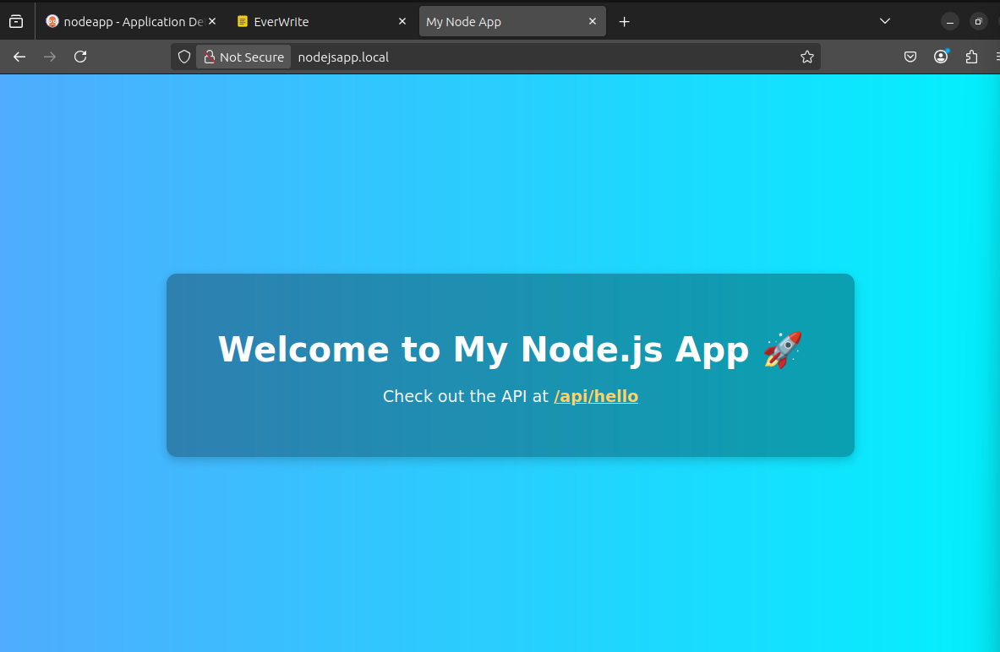
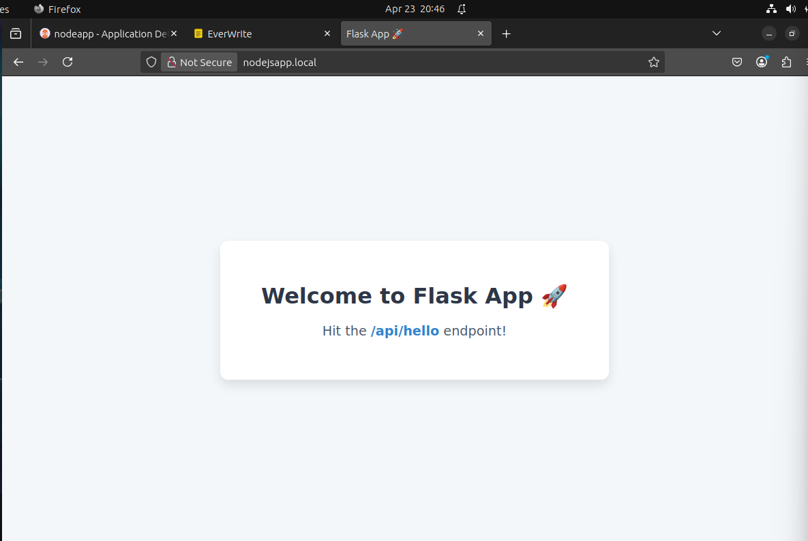

# 🚀 End-to-End GitOps Pipeline: Node.js App Deployment Using ArgoCD, GitHub Actions, Docker & Kubernetes (with Canary Strategy).
 
This project implements a **complete GitOps workflow to deploy a containerized Node.js application onto a Kubernetes cluster using ArgoCD.** The application is built using Docker, tested automatically with GitHub Actions, and follows a multi-branch Git strategy (dev → test → main) ensuring reliable and production-grade deployments.
Additionally, a Canary Deployment strategy is integrated, allowing gradual rollouts of new application versions, minimizing risk in production.

---

## 🌐 Live Screenshots

### 🖼️ Stable Webpage


### 🖼️ ArgoCD page 


### 🖼️ Canary Webpage


---


# 🚀 Project Highlights

## GitOps with ArgoCD
Kubernetes resources are automatically synced from a GitHub repository, enabling true Git-driven deployments.

---

## Multi-Branch Git Strategy
- **dev** branch: Developers push feature updates and changes.
- **test** branch: Testers validate merged code from the `dev` branch.
- **main** branch: Only production-ready, fully tested code is merged and deployed.

---

## Automated CI/CD with GitHub Actions
- Trigger builds on `dev` and `test` branches automatically.
- Run unit tests using **Jest** before allowing merges into `main`.
- Build and push Docker images to DockerHub after successful tests.

---

## Containerized Application
Docker is used to package the Node.js application, ensuring easy deployment, scalability, and consistency across environments.

---

## Canary Deployments on Kubernetes
New application versions are progressively rolled out to a subset of users using native Kubernetes deployment strategies, minimizing production risk.

---

## No Istio Used
This project achieves canary deployment without using service meshes like Istio, keeping the architecture lightweight and simple.

---

## Simple, Scalable, and Production-Ready Architecture
Designed to be easily maintainable, horizontally scalable, and aligned with industry best practices for real-world production deployments.


---

# ✨ Workflow Overview

## Developer Stage
- Developers push code to the `dev` branch.

---

## Testing Stage
- Testers merge the `dev` branch into the `test` branch.
- GitHub Actions automatically run unit tests and validate the code.

---

## Production Stage
- Upon successful testing, code is merged into the `main` branch.
- GitHub Actions build and push Docker images to DockerHub.
- ArgoCD auto-syncs changes from the `main` branch to the Kubernetes cluster.

---

## Deployment Strategy
- Kubernetes deploys new pods using a **Canary rollout strategy**, gradually shifting traffic to the new version.
- After successful validation, the system completes a full rollout automatically.


---

## 🛠️ Git Production Strategy

### 📌 Branches

| Branch | Role                         |
|--------|------------------------------|
| `dev`  | Developer contributions      |
| `test` | QA/Test verification branch  |
| `main` | Production/stable code only  |

---

### 🔄 Flow

1. Developers push code to `dev` 🧑‍💻  
2. Testers validate and merge `dev` → `test` ✔️  
3. **GitHub Actions** kicks in:
   - ✅ Runs tests
   - 🛠 Builds and pushes Docker image
   - 🔄 Automatically merges `test` → `main`

---

### ✅ This Strategy Ensures:
- Code is **tested before hitting production**
- `main` stays **stable** and **trustworthy**
- CI/CD workflow is **clean**, **repeatable**, and **reliable**

# 📋 Post-Deployment Steps – Accessing App via Custom DNS (`nodejsapp.local`)

After ArgoCD successfully deploys the application into the Kubernetes cluster, follow these steps to map a friendly DNS name (`nodejsapp.local`) to access the app easily.

---

## 🛠️ Steps to Map DNS and Access the App

### 1️⃣ Get the Minikube Node IP

Run the following command to get the Minikube cluster node IP:

```bash
minikube ip
```

### Example Output:

```plaintext
192.168.49.2
```

### 2️⃣ Update /etc/hosts File

Modify the local /etc/hosts file to point nodejsapp.local to the Minikube IP:

```bash
sudo nano /etc/hosts
```

### ➔ Add the following line at the bottom:

```plaintext
192.168.49.2 nodejsapp.local
```
> ✅ Replace 192.168.49.2 with your actual Minikube IP if different.

### 3️⃣ Access the Application

Now you can access the deployed Node.js application using the custom domain:

- In the browser:

```plaintext
http://nodejsapp.local
```

## 🧠 Summary

With this setup:

- 🧑‍💻 Developers and testers have **isolated roles**
- ✅ Code is **tested** before going to production
- 🔒 `main` always has **production-ready** code
- 🤖 Workflows are **automated** and **reproducible**

---

> Made with ❤️ using Node.js, Docker, Kubernetes, ArgoCD, GitHub Actions, and a passion for clean GitOps-driven DevOps pipelines by Dhanush Nadar.

